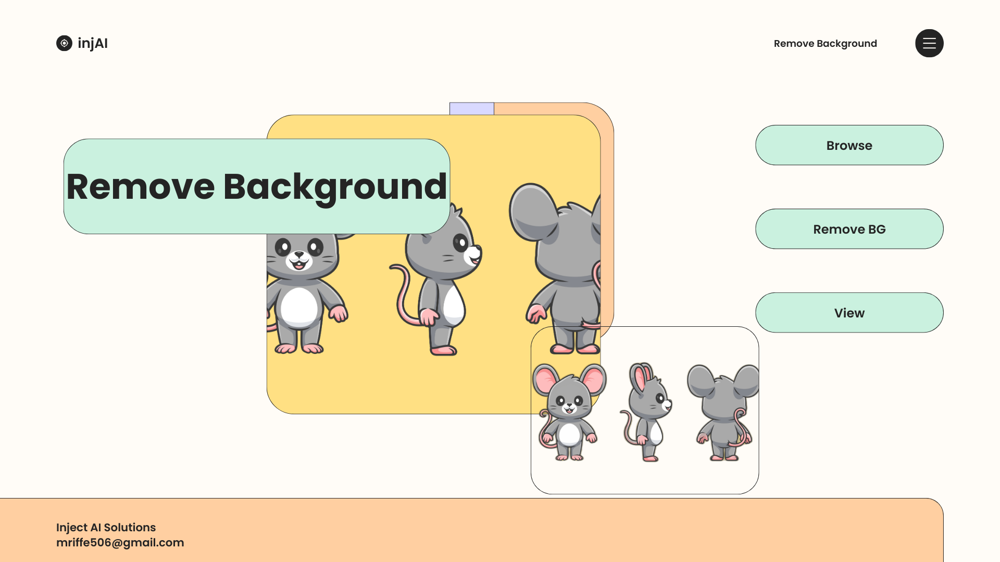

# 🖼️ Remove Background - Desktop Application

A simple and powerful desktop-based Python application that removes the background from images with a single click.
---

## 🖼️ Screenshot



---
## 🚀 Features

- ✅ Easy-to-use GUI
- 🖼️ Supports JPG, PNG, and other popular image formats
- ✂️ Automatically removes background from selected images
- 💾 Saves the output with transparent background
- ⚡ Built with Python and popular image processing libraries

## 📦 Requirements

- Python 3.x
- The following Python packages (auto-installed via `requirements.txt`):
  - `rembg`
  - `Pillow`
  - `PyQt5`
  - `opencv-python`

## 🔧 Installation

1. **Clone the repository:**

   ```bash
   git clone https://github.com/MalikAbdulSalam/Remove-background.git
   cd Remove-background
   conda env create -f environment.yaml

## 🔧 Inference

   ```bash
   conda activate rmbg
   python main.py
